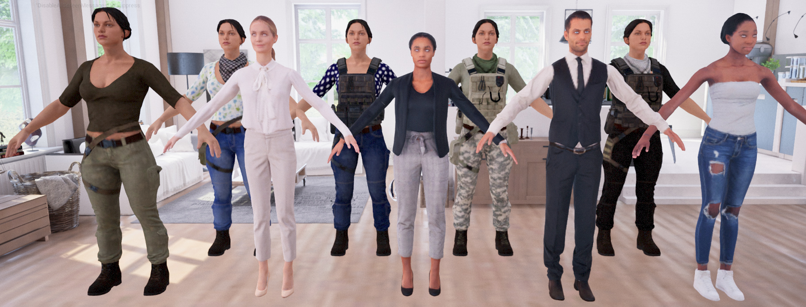
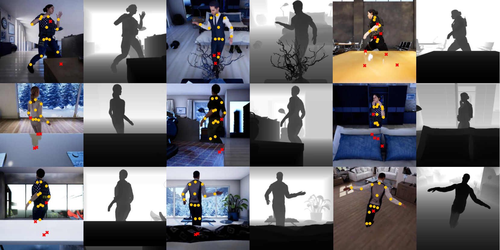

# Occlusion-Person Dataset

## Overview


Fig 1 Human models we used in *Occlusion-Person*

The previous benchmarks do not provide occlusion labels for the joints in images which prevents us from performing numerical evaluation on the occluded joints. In addition, the amount of occlusion in the benchmarks is limited. To address the limitations, we propose to construct this synthetic dataset *Occlusion-Person*. We adopt [UnrealCV](https://unrealcv.org/) to render multiview images and depth maps from 3D models. 

In particular, thirteen human models of different clothes are put into nine different scenes such as living rooms, bedrooms and offices. The human models are driven by the poses selected from the CMU Motion Capture database. We purposely use objects such as sofas and desks to occlude some body joints. Eight cameras are placed in each scene to render the multiview images and the depth maps. We provide the 3D locations of 15 joints as ground truth. 

The occlusion label for each joint in an image is obtained by comparing its depth value (available in the depth map), to the depth of the 3D joint in the camera coordinate system. If the difference between the two depth values is smaller than 30cm, then the joint is not occluded. Otherwise, it is occluded.  The table below compares this dataset to the existing benchmarks. In particular, about 20% of the body joints are occluded in our dataset. 

| Dataset          | Frames | Cameras | Occluded Joints |
|------------------|:------:|:-------:|:---------------:|
| Human3.6M        |  784k  |    4    |        -        |
| Total Capture    |  236k  |    8    |        -        |
| Panoptic         |   36k  |    31   |        -        |
| Occlusion-Person |   73k  |    8    |      20.3%      |



Fig 2 Some typical images, ground-truth 2D joint locations and the depth maps. The joint represented by red `x` means it is occluded.


## Download & Extract

Please manually download from [OneDrive](https://dllabml-my.sharepoint.com/:f:/g/personal/research_dllabml_onmicrosoft_com/Et_em__avxZBp6DBz3u7uNkBzxazl7QpfzJ0w3JRhWkL4A) to a folder, e.g. `./data`, for now. (We are working on writing a script to automatically fetch the data). We split it into 53 parts due to per file size limit of OneDrive. Each part is about 1GB.

After all parts are fully downloaded, you should have files like this:
```
data
├── occlusion_person.zip.001
├── occlusion_person.zip.002
├── ...
├── occlusion_person.zip.053
```
You can run `find ./data -type f | xargs md5sum > downloaded_checksum.txt` to generate all MD5 checksum for the files (this may take long time). Then compare it to our pre-generated checksum file `checksum.txt` by `diff checksum.txt downloaded_checksum.txt`.

Then, extract the `images.zip` by `7z x ./data/occlusion_person.zip.001`. You should have `images.zip` in current directory.

We also provide the train/val annotation files used in our experiments at [OneDrive/annot](https://dllabml-my.sharepoint.com/:f:/g/personal/research_dllabml_onmicrosoft_com/Esvv1AneSPxLogt4oVRU6XkBCXpynjlcJTfFsNEEgdv3LQ?e=dlODDF). 

Finally, organize the images and annotations into below structure:
```
unrealcv
├── images.zip
├── annot
    ├── unrealcv_train.pkl
    ├── unrealcv_validation.pkl
```

All done.

## Citation
Our work is under review, we will add it later.
